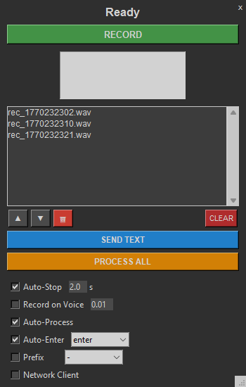

# VoiceInputter

A Python automation tool that integrates with a local ComfyUI API for advanced voice-to-text input. It records audio, processes it through a ComfyUI workflow (using Whisper), and types the result directly into your active window.



## Key Features

### 🎙️ Advanced Audio Control
- **Voice Activity Detection (VAD):**
  - **Auto-Stop:** Automatically stops recording when you stop speaking.
  - **Voice Trigger:** Automatically starts recording when you begin speaking.
- **Concurrent Processing:** Record a new clip immediately while the previous one is being transcribed. No waiting required.

### 📝 Smart Text Processing
- **Dynamic Prefixes:** Automatically add prefixes to your text with smart reordering support:
  - `1., 2., 3.` (Numbered list that auto-updates when you reorder items)
  - `a), b), c)` (Lettered list)
  - `- ` (Bullet points)
- **Auto-Enter Modes:** Choose how the text is submitted:
  - `Enter` (Standard)
  - `Shift+Enter` (New line without sending)
  - `Ctrl+Enter` (Submit in forms)

### 🖥️ Desktop Integration
- **Always-on-Top Overlay:** A compact, draggable interface that stays visible over your applications.
- **Auto-Type:** Automatically pastes the transcribed text into the active window.
- **Clipboard Management:** Uses clipboard injection for fast and reliable text entry.

## Requirements

- Python 3.10+
- [ComfyUI](https://github.com/comfyanonymous/ComfyUI) running locally on port 8188.
- A ComfyUI workflow saved as `stt.json` (must include "Apply Whisper" and "Preview Text" nodes).

## Installation

1.  **Clone the repository:**
    ```bash
    git clone https://github.com/sysoutch/VoiceInputter.git
    cd VoiceInputter
    ```

2.  **Install dependencies:**
    ```bash
    pip install -r requirements.txt
    ```

## Usage

1.  **Start ComfyUI:** Ensure your local ComfyUI instance is running.
2.  **Launch the App:**
    ```bash
    python voice_inputter.py
    ```
    *Or run the built executable if available.*
3.  **Controls:**
    - **F9 (Global Hotkey):** Toggle recording manually.
    - **UI Controls:** Use the overlay to toggle VAD settings, change prefix modes, or manage the recording queue.
4.  **Workflow:**
    - Select a text field in any application (e.g., Notepad, Discord, ChatGPT).
    - Speak. The app records, transcribes, and types the text for you.

## Building from Source

To create a standalone executable:

1.  Install PyInstaller:
    ```bash
    pip install pyinstaller
    ```
2.  Run the build command:
    ```bash
    pyinstaller --onefile --windowed --add-data "stt.json;." voice_inputter.py
    ```
3.  The executable will be located in the `dist/` folder.

## Project Structure

- `src/`: Core modules (Audio, GUI, Network, ComfyUI client).
- `voice_inputter.py`: Main entry point and coordinator.
- `stt.json`: The ComfyUI workflow definition.
